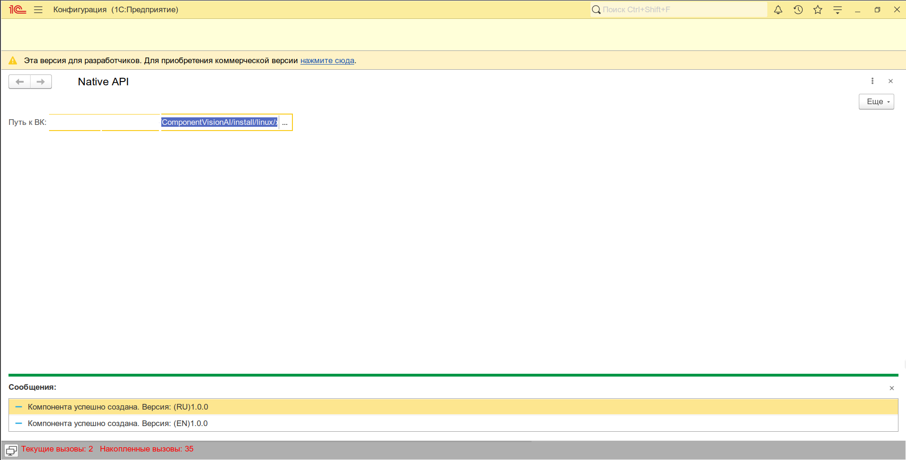

---

# Шаблон внешней компоненты 1С на C++ (Native API)

Этот репозиторий представляет собой кроссплатформенный шаблон для создания внешних компонент для платформы "1С:Предприятие" с использованием технологии Native API. Проект использует CMake для системы сборки и Conan для управления зависимостями, что обеспечивает простую и повторяемую сборку под Windows и Linux.

## Особенности

- **Кроссплатформенность**: Единая кодовая база для Windows и Linux.
- **Современный C++**: Настроен на использование стандарта C++17.
- **Система сборки CMake**: Сборка и управление проектом.
- **Управление зависимостями Conan**: Добавление сторонних библиотек.
- **Автоматизированная сборка**: Единая команда для сборки под текущую ОС и архитектуру.
- **Готовая структура**: Организация файлов для удобной работы..
- **Пример реализации**: Включает базовую реализацию компоненты с одним методом `GetVersion()` (`ПолучитьВерсию()`).
- **Тестовая обработка**: Поставляется с обработкой `.epf` для быстрой проверки компоненты в 1С.

## Структура проекта

```
.
├── include/              # Заголовочные файлы 1C Native API
├── install/              # Директория для скомпилированных артефактов
│   └── NativeAPI.epf     # Тестовая обработка для 1С
├── scripts/              # Скрипты сборки для разных ОС (.bat для Windows, .sh для Linux)
├── src/                  # Исходный код компоненты
├── build.cmake           # Главный скрипт CMake, точка входа для сборки
├── CMakeLists.txt        # Основной конфигурационный файл CMake
├── conanfile.py          # Файл для управления зависимостями через Conan
└── version.script        # Линкер-скрипт для Unix-подобных систем
```

- **`include/`**: Содержит заголовочные файлы Native API и заголовочные файлы проекта (`AddInNative.h`).
- **`src/`**: Основные файлы реализации (`.cpp`). Здесь вы будете писать логику вашей компоненты.
- **`scripts/`**: Вспомогательные скрипты, которые вызываются из главного `build.cmake` для выполнения сборки. Вам не нужно запускать их напрямую.
- **`install/`**: Сюда помещаются готовые бинарные файлы (`.dll` или `.so`) после успешной сборки. Здесь же находится тестовая обработка `NativeAPI.epf`.
- **`build.cmake`**: Оркестратор сборки. Он определяет ОС, архитектуру и запускает соответствующий скрипт из папки `scripts` с нужными параметрами.
- **`CMakeLists.txt`**: "Сердце" проекта. Описывает, как CMake должен собирать проект: какие файлы компилировать, какие библиотеки подключать и т.д.
- **`conanfile.py`**: Декларирует зависимости проекта. Чтобы добавить новую библиотеку, нужно указать ее здесь.

## Требования

Для сборки проекта вам понадобятся:
1.  **CMake** (версия 3.15 или выше).
2.  **C++ компилятор**:
    -   Для Windows: MSVC (Visual Studio 2017 или новее).
    -   Для Linux: GCC или Clang.
3.  **Conan**: менеджер пакетов для C++. Установить можно через pip:
    ```bash
    pip install conan
    ```
4.  **(Рекомендуется)** **Ninja**: система сборки, которая работает быстрее, чем стандартные Makefiles.
    ```bash
    pip install ninja
    ```

## Сборка проекта

Сборка запускается одной командой из корневой директории проекта.

1.  **Клонируйте репозиторий**:
    ```bash
    git clone https://github.com/nmaks2012/1c-native-component-template.git
    cd 1c-native-component-template
    ```

2.  **Запустите сборку**:

    -   Для **Release**-версии:
        ```bash
        cmake -DBUILD_TYPE=release -P build.cmake
        ```
    -   Для **Debug**-версии:
        ```bash
        cmake -DBUILD_TYPE=debug -P build.cmake
        ```

Скрипт `build.cmake` автоматически определит операционную систему (Windows/Linux) и архитектуру (x86_64), после чего запустит процесс сборки.

После завершения скомпилированная библиотека будет находиться в папке `install`. Например:
-   **Windows**: `install/windows/x86_64/AddInNative_x86_64.dll`
-   **Linux**: `install/linux/x86_64/libAddInNative_x86_64.so`

## Тестирование компоненты

Для проверки работоспособности скомпилированной компоненты в каталоге `install` находится тестовая обработка `NativeAPI.epf`.

1.  Запустите 1С:Предприятие в режиме толстого или тонкого клиента.
2.  Откройте файл `install/NativeAPI.epf` (через меню `Файл` -> `Открыть`).
3.  В поле "Путь к ВК" укажите полный путь к скомпилированной библиотеке (`.dll` или `.so`).
4.  Нажмите кнопку для подключения компоненты и вызова ее методов.
5.  Результат выполнения будет выведен в окне сообщений.

### Пример работы



## Кастомизация и разработка

### 1. Переименование проекта

Если вы хотите изменить имя выходного файла (например, с `AddInNative` на `MySuperComponent`), вам нужно отредактировать `CMakeLists.txt`:
-   Измените имя проекта в строке `PROJECT(AddInNative CXX)`.
-   При необходимости измените `OUTPUT_NAME` в `set_target_properties`.

### 2. Добавление новых методов и свойств

Вся логика компоненты реализуется в классе `CAddInNative` (`src/AddInNative.cpp` и `include/AddInNative.h`).

Чтобы добавить новый метод:
1.  **Объявите его в `AddInNative.h`**: Добавьте новый идентификатор в `enum Methods`.
2.  **Добавьте имена метода**: В файле `src/AddInNative.cpp` добавьте системное и русское имя метода в массивы `g_MethodNames` и `g_MethodNamesRu`.
3.  **Определите количество параметров**: В методе `CAddInNative::GetNParams()` добавьте `case` для вашего нового метода.
4.  **Реализуйте логику**: В методах `CAddInNative::CallAsProc()` (для процедур) или `CAddInNative::CallAsFunc()` (для функций) добавьте `case` для обработки вызова вашего метода.

### 3. Управление зависимостями

Проект использует Conan для подключения внешних библиотек. В качестве примера в файлах `CMakeLists.txt` и `conanfile.py` есть закомментированные строки для подключения **OpenCV**.

Чтобы добавить и использовать OpenCV:
1.  **Раскомментируйте строку в `conanfile.py`**:
    ```python
    def requirements(self):
        self.requires("opencv/4.12.0") # <--- Раскомментировать
    ```
2.  **Раскомментируйте строки в `CMakeLists.txt`**:
    ```cmake
    # Поиск и подключение зависимости OpenCV
    find_package(OpenCV REQUIRED) # <--- Раскомментировать

    # Добавление путей к заголовочным файлам
    include_directories(${OpenCV_INCLUDE_DIRS}) # <--- Раскомментировать
    
    # ...

    # Линковка с OpenCV
    target_link_libraries(${PROJECT_NAME} PRIVATE opencv_core opencv_imgproc) # <--- Раскомментировать (укажите нужные модули)
    ```
После этого запустите сборку снова. Conan автоматически скачает и настроит OpenCV, а CMake подключит его к вашему проекту.